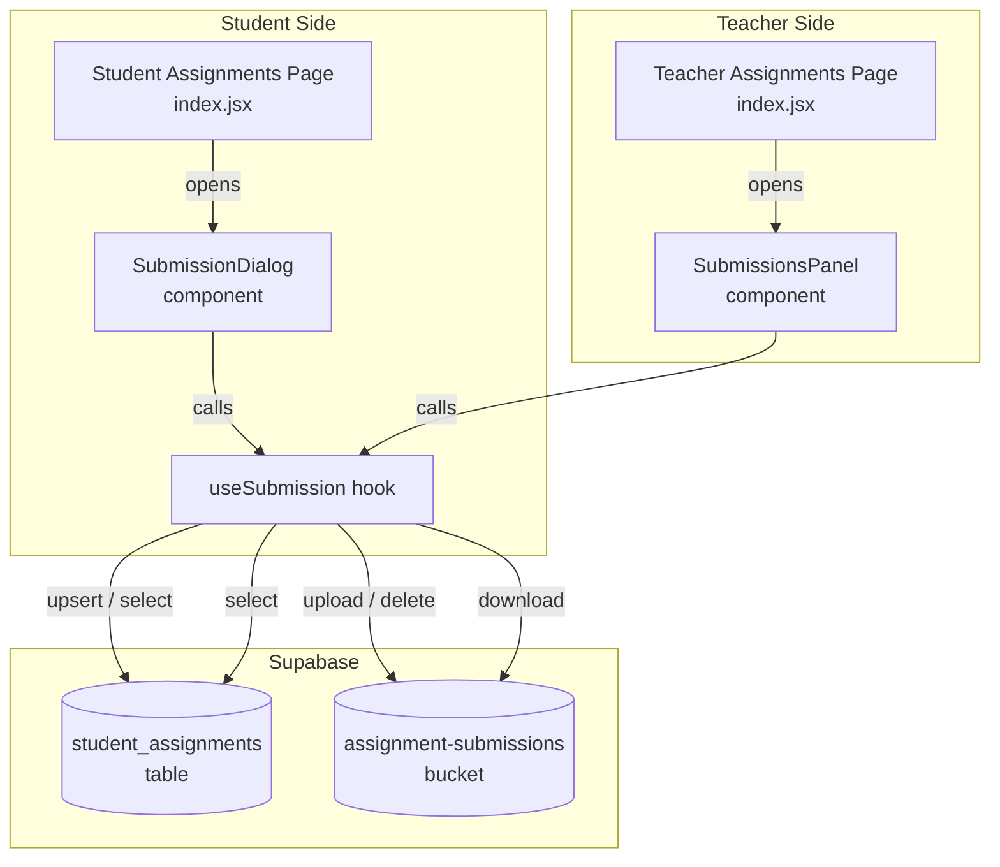
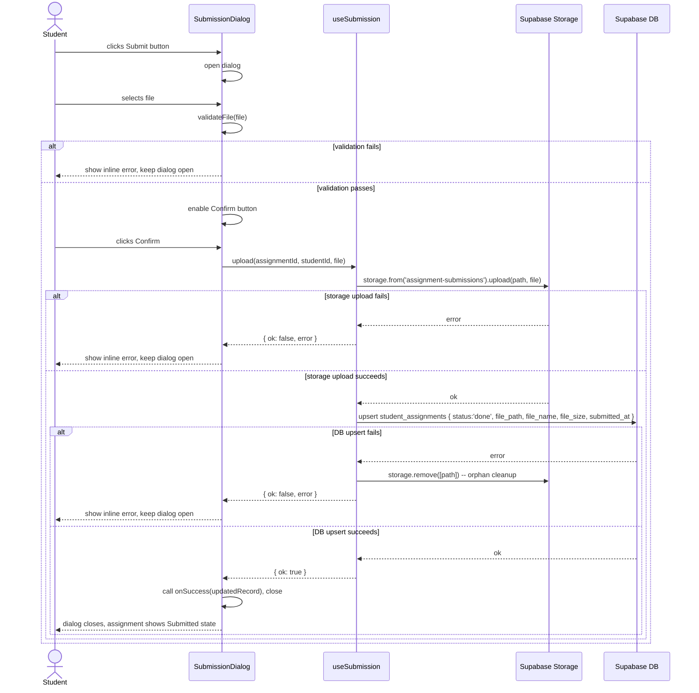
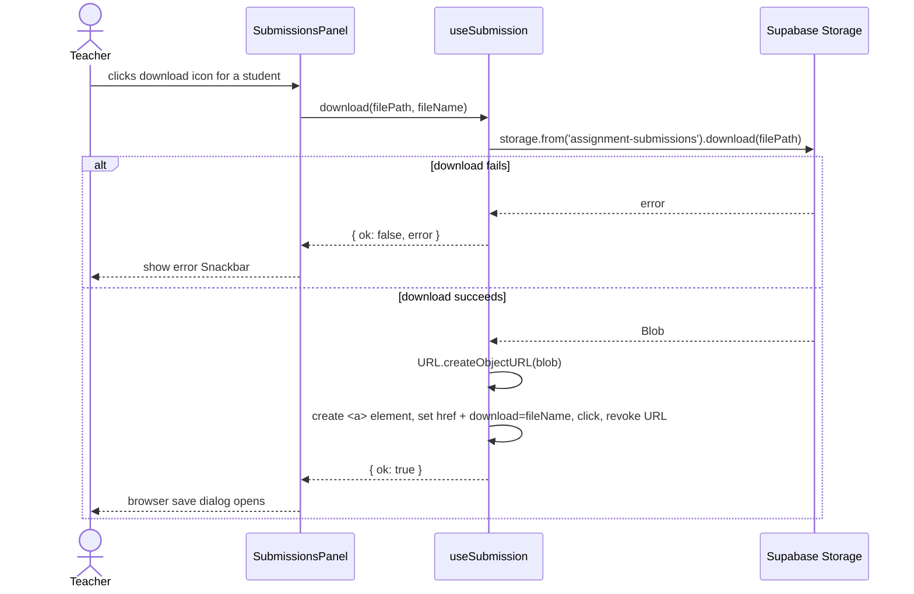

# Design Document — Assignment Submission

## Overview

The Assignment Submission feature adds file-based submission to the Smart Education platform. Students upload files against their assignments; the upload atomically marks the assignment as done. Teachers gain a per-assignment submissions panel to track and download student work. Late submissions are accepted but visually flagged.

The design extends the existing `student_assignments` table with four nullable columns, introduces a dedicated `assignment-submissions` Supabase Storage bucket, adds a `useSubmission` custom hook, a `SubmissionDialog` component, and a `SubmissionsPanel` component. It modifies the Student Assignments page and the Teacher Assignments page.

---

## Architecture



### Data Flow Summary

- **Upload**: `SubmissionDialog` → `useSubmission.upload()` → Storage upload → DB upsert → local state update
- **Resubmit**: `SubmissionDialog` → `useSubmission.resubmit()` → Storage delete old → Storage upload new → DB upsert → local state update
- **Download**: `SubmissionsPanel` → `useSubmission.download()` → Storage download → browser `<a>` click

---

## Components and Interfaces

### `useSubmission` hook — `src/hooks/useSubmission.js`

Encapsulates all storage and database operations for submissions. Consumed by both `SubmissionDialog` and `SubmissionsPanel`.

```js
// Return shape
{
  uploading: boolean,          // true while an upload/resubmit is in progress
  uploadProgress: number,      // 0–100 (reserved for future XHR progress; set to 0 during upload, 100 on complete)
  error: string | null,        // last error message, cleared on next operation

  // Upload a new file for an assignment (first submission)
  upload(assignmentId, studentId, file): Promise<{ ok: boolean, error?: string }>,

  // Replace an existing submission (resubmission)
  resubmit(assignmentId, studentId, file, oldFilePath): Promise<{ ok: boolean, error?: string }>,

  // Download a submitted file and trigger browser save
  download(filePath, fileName): Promise<{ ok: boolean, error?: string }>,

  // Fetch all student_assignment rows for a given assignment (teacher panel)
  fetchSubmissions(assignmentId): Promise<SubmissionRecord[]>,
}
```

**`SubmissionRecord` shape** (returned by `fetchSubmissions`):

```js
{
  studentId:   string,   // UUID
  studentName: string,
  status:      'done' | 'pending',
  filePath:    string | null,
  fileName:    string | null,
  fileSize:    string | null,   // human-readable, e.g. "2.4 MB"
  submittedAt: string | null,   // ISO 8601 timestamptz
}
```

---

### `SubmissionDialog` component — `src/components/SubmissionDialog.jsx`

Modal dialog for file selection, validation, and upload confirmation.

```jsx
<SubmissionDialog
  open={boolean}
  onClose={() => void}
  assignment={{ id, title, due_date }}
  studentId={string}
  existingSubmission={{          // null if no prior submission
    fileName: string,
    fileSize: string,
    submittedAt: string,         // ISO 8601
    filePath: string,
  } | null}
  onSuccess={(updatedRecord) => void}  // called after successful upload/resubmit
/>
```

**Internal state:**

| State variable | Type | Purpose |
|---|---|---|
| `selectedFile` | `File \| null` | File chosen by the user |
| `validationError` | `string \| null` | MIME/size error message |
| `isLateWarning` | `boolean` | True when current time > deadline (display-only, no blocking) |

**Behaviour:**
1. On file selection → run `validateFile(file)` → set `validationError` or clear it
2. Confirm button enabled only when `selectedFile !== null && validationError === null && !uploading`
3. On confirm → call `useSubmission.upload()` or `useSubmission.resubmit()` depending on `existingSubmission`
4. On success → call `onSuccess(updatedRecord)` and close
5. On error → display `useSubmission.error` inline; keep dialog open

---

### `SubmissionsPanel` component — `src/components/SubmissionsPanel.jsx`

Teacher-facing dialog listing all enrolled students and their submission status for one assignment.

```jsx
<SubmissionsPanel
  open={boolean}
  onClose={() => void}
  assignment={{ id, title, due_date }}
  courseId={string}
/>
```

**Internal state:**

| State variable | Type | Purpose |
|---|---|---|
| `submissions` | `SubmissionRecord[]` | Fetched from `useSubmission.fetchSubmissions` |
| `enrolledStudents` | `{ id, name }[]` | Fetched from `enrollments` + `profiles` |
| `loading` | `boolean` | True while fetching |
| `downloadError` | `string \| null` | Shown in Snackbar on download failure |

**Behaviour:**
1. On open → fetch enrolled students (via `TeacherContext.fetchEnrolledStudents`) and submissions in parallel
2. Merge by `studentId` to produce a unified list
3. Render summary chip: `"X / Y submitted"`
4. Per row: student name, status chip, formatted timestamp, `Late_Badge` (if applicable), download `IconButton` (if submitted)
5. Download click → `useSubmission.download(filePath, fileName)` → on error show Snackbar

---

### Utility functions — `src/utils/submissionUtils.js`

```js
// Returns true when submitted_at is after due_date 23:59:59 UTC
export function isLate(submittedAt, dueDate) {
  if (!submittedAt || !dueDate) return false;
  return new Date(submittedAt) > new Date(dueDate + 'T23:59:59Z');
}

// Converts bytes to human-readable string, e.g. 2516582 → "2.4 MB"
export function formatFileSize(bytes) {
  if (bytes === 0) return '0 B';
  const units = ['B', 'KB', 'MB', 'GB'];
  const i = Math.floor(Math.log(bytes) / Math.log(1024));
  return (bytes / Math.pow(1024, i)).toFixed(i === 0 ? 0 : 1) + ' MB'.replace('MB', units[i]);
}

// Validates a File object; returns null on success or an error string
export function validateFile(file) {
  const ALLOWED_MIME = new Set([
    'application/pdf',
    'application/vnd.openxmlformats-officedocument.wordprocessingml.document',
    'application/msword',
    'image/jpeg',
    'image/png',
    'application/zip',
  ]);
  const MAX_BYTES = 10_485_760; // 10 MB

  if (!ALLOWED_MIME.has(file.type)) {
    return 'Accepted formats: PDF, DOCX, DOC, JPG, PNG, ZIP';
  }
  if (file.size === 0 || file.size > MAX_BYTES) {
    return 'File must be between 1 byte and 10 MB';
  }
  return null;
}
```

---

### Student Assignments page changes — `src/pages/student/Assignments/index.jsx`

- **Remove** the `Checkbox` / `toggleDone` logic from `renderItem`.
- **Add** a `Submit` / `Resubmit` `Button` in the `secondaryAction` slot:
  - No submission (`completions[id]?.file_path == null`): renders `<Button variant="outlined" size="small">Submit</Button>`
  - Has submission: renders `<Button variant="contained" size="small" color="success">Resubmit</Button>` plus the file name and formatted timestamp below the title
- **Add** `Late_Badge` (`<Chip label="Late" color="warning" size="small" />`) when `isLate(completions[id]?.submitted_at, item.due_date)` is true
- **Add** `<SubmissionDialog>` rendered once at the bottom of the component, controlled by `dialogOpen` / `selectedAssignment` state
- **Update** `load()` to also select `file_path, file_name, file_size, submitted_at` from `student_assignments`
- **Remove** `completed_at` from the select (replaced by `submitted_at`)

---

### Teacher Assignments page changes — `src/pages/teacher/Assignments/index.jsx`

- **Add** a `Visibility` `IconButton` in the Actions column (before Edit/Delete):
  ```jsx
  <Tooltip title="View Submissions">
    <IconButton size="small" onClick={() => openSubmissionsPanel(item)}>
      <Visibility fontSize="small" />
    </IconButton>
  </Tooltip>
  ```
- **Add** `<SubmissionsPanel>` rendered once at the bottom, controlled by `panelOpen` / `selectedAssignment` state

---

## Data Models

### `student_assignments` table (extended)

| Column | Type | Nullable | Default | Notes |
|---|---|---|---|---|
| `assignment_id` | `uuid` | NO | — | FK → assignments.id |
| `student_id` | `uuid` | NO | — | FK → auth.users.id |
| `status` | `text` | NO | `'pending'` | `'pending'` or `'done'` |
| `completed_at` | `timestamptz` | YES | `null` | Legacy; kept for backward compat |
| `file_path` | `text` | YES | `null` | Storage object path |
| `file_name` | `text` | YES | `null` | Original file name |
| `file_size` | `text` | YES | `null` | Human-readable size, e.g. "2.4 MB" |
| `submitted_at` | `timestamptz` | YES | `null` | UTC timestamp of latest submission |

### `assignment-submissions` storage bucket

| Property | Value |
|---|---|
| Bucket name | `assignment-submissions` |
| Public | `false` |
| Max object size | 10,485,760 bytes (10 MB) |
| Path pattern | `{assignment_id}/{student_id}/{file_name}` |
| Allowed MIME types | pdf, docx, doc, jpg, png, zip |

### Storage path examples

```
550e8400-e29b-41d4-a716-446655440000/
  a87ff679-a2f3-471d-8360-7e0ea50c0d2b/
    homework_chapter3.pdf
    report_v2.docx
```

---

## Sequence Diagrams

### Upload flow (first submission)



### Resubmission flow

```mermaid
sequenceDiagram
    actor Student
    participant SD as SubmissionDialog
    participant US as useSubmission
    participant ST as Supabase Storage
    participant DB as Supabase DB

    Student->>SD: clicks Resubmit button
    SD->>SD: open dialog (shows prior file info)
    Student->>SD: selects new file
    SD->>SD: validateFile(file)
    Student->>SD: clicks Confirm
    SD->>US: resubmit(assignmentId, studentId, newFile, oldFilePath)
    US->>ST: storage.remove([oldFilePath])
    Note over US,ST: old file deleted first
    US->>ST: storage.upload(newPath, newFile)
    alt upload fails
        ST-->>US: error
        US-->>SD: { ok: false, error }
        SD-->>Student: show inline error; prior record unchanged
    else upload succeeds
        US->>DB: upsert student_assignments { file_path, file_name, file_size, submitted_at }
        alt DB upsert fails
            DB-->>US: error
            US->>ST: storage.remove([newPath])  -- cleanup new orphan
            US-->>SD: { ok: false, error }
            SD-->>Student: show inline error; record still points to prior submission
        else DB upsert succeeds
            US-->>SD: { ok: true }
            SD-->>Student: dialog closes, updated submission info shown
        end
    end
```

### Teacher download flow



---

## SQL Migration

**File:** `supabase/migrations/assignment_submission_columns.sql`

```sql
-- ─────────────────────────────────────────────────────────────────────────────
-- Migration: assignment_submission_columns
-- Adds file submission metadata columns to student_assignments and creates
-- the assignment-submissions storage bucket with RLS policies.
-- ─────────────────────────────────────────────────────────────────────────────

-- 1. Extend student_assignments table
ALTER TABLE public.student_assignments
  ADD COLUMN IF NOT EXISTS file_path    text        DEFAULT NULL,
  ADD COLUMN IF NOT EXISTS file_name    text        DEFAULT NULL,
  ADD COLUMN IF NOT EXISTS file_size    text        DEFAULT NULL,
  ADD COLUMN IF NOT EXISTS submitted_at timestamptz DEFAULT NULL;

-- 2. Create the storage bucket (idempotent via INSERT ... ON CONFLICT DO NOTHING)
INSERT INTO storage.buckets (id, name, public, file_size_limit, allowed_mime_types)
VALUES (
  'assignment-submissions',
  'assignment-submissions',
  false,
  10485760,
  ARRAY[
    'application/pdf',
    'application/vnd.openxmlformats-officedocument.wordprocessingml.document',
    'application/msword',
    'image/jpeg',
    'image/png',
    'application/zip'
  ]
)
ON CONFLICT (id) DO NOTHING;

-- 3. Enable RLS on storage.objects (already enabled by default in Supabase,
--    but included for explicitness)
-- ALTER TABLE storage.objects ENABLE ROW LEVEL SECURITY;

-- ── Storage RLS Policies ──────────────────────────────────────────────────────

-- Drop existing policies to allow idempotent re-runs
DROP POLICY IF EXISTS "Students can upload their own submissions"  ON storage.objects;
DROP POLICY IF EXISTS "Students can delete their own submissions"  ON storage.objects;
DROP POLICY IF EXISTS "Students can read their own submissions"    ON storage.objects;
DROP POLICY IF EXISTS "Teachers can read course submissions"       ON storage.objects;

-- WRITE (INSERT): only the submitting student may upload
-- Path pattern: {assignment_id}/{student_id}/{file_name}
-- auth.uid()::text must match the second path segment
CREATE POLICY "Students can upload their own submissions"
  ON storage.objects FOR INSERT
  WITH CHECK (
    bucket_id = 'assignment-submissions'
    AND auth.uid()::text = (string_to_array(name, '/'))[2]
  );

-- DELETE: only the submitting student may delete their own file
CREATE POLICY "Students can delete their own submissions"
  ON storage.objects FOR DELETE
  USING (
    bucket_id = 'assignment-submissions'
    AND auth.uid()::text = (string_to_array(name, '/'))[2]
  );

-- READ (SELECT): submitting student OR teacher who owns the assignment's course
CREATE POLICY "Students can read their own submissions"
  ON storage.objects FOR SELECT
  USING (
    bucket_id = 'assignment-submissions'
    AND auth.uid()::text = (string_to_array(name, '/'))[2]
  );

CREATE POLICY "Teachers can read course submissions"
  ON storage.objects FOR SELECT
  USING (
    bucket_id = 'assignment-submissions'
    AND EXISTS (
      SELECT 1
      FROM public.assignments a
      JOIN public.courses c ON c.id = a.course_id
      WHERE a.id::text = (string_to_array(name, '/'))[1]
        AND c.teacher_id = auth.uid()
    )
  );
```

---

## Correctness Properties

*A property is a characteristic or behavior that should hold true across all valid executions of a system — essentially, a formal statement about what the system should do. Properties serve as the bridge between human-readable specifications and machine-verifiable correctness guarantees.*

### Property 1: Storage path construction

*For any* `assignment_id`, `student_id`, and `file_name`, the storage path constructed by the upload logic shall equal `"{assignment_id}/{student_id}/{file_name}"`.

**Validates: Requirements 1.4, 7.3**

---

### Property 2: Submission timestamp formatting

*For any* submitted `student_assignment` with a non-null `submitted_at` and `file_name`, the rendered submission status string shall contain the `file_name` and the `submitted_at` value formatted as `"MMM DD, YYYY h:mm a"` (e.g., `"Jan 03, 2025 10:35 AM"`).

**Validates: Requirements 1.2, 3.1**

---

### Property 3: MIME type validation

*For any* MIME type string, `validateFile` shall return `null` (pass) if and only if the MIME type is one of `application/pdf`, `application/vnd.openxmlformats-officedocument.wordprocessingml.document`, `application/msword`, `image/jpeg`, `image/png`, or `application/zip`.

**Validates: Requirements 2.1, 2.2**

---

### Property 4: File size validation

*For any* integer `n` representing a file size in bytes, `validateFile` shall return `null` (pass) if and only if `0 < n ≤ 10,485,760`.

**Validates: Requirements 2.3, 2.4**

---

### Property 5: Late submission detection

*For any* `submitted_at` ISO timestamp and `due_date` date string, `isLate(submitted_at, due_date)` shall return `true` if and only if `new Date(submitted_at) > new Date(due_date + 'T23:59:59Z')`.

**Validates: Requirements 4.2, 4.3**

---

### Property 6: Submission count summary

*For any* list of `SubmissionRecord` objects, the submission count summary displayed in `SubmissionsPanel` shall equal `(count of records where filePath !== null) / (total records)`, formatted as `"X / Y submitted"`.

**Validates: Requirements 5.6**

---

### Property 7: formatFileSize round-trip accuracy

*For any* integer `n` in the range `[1, 10,485,760]`, `formatFileSize(n)` shall return a non-empty string containing a numeric value and a unit suffix (`B`, `KB`, or `MB`), and the numeric value shall be within 5% of the true converted value.

**Validates: Requirements 6.3**

---

## Error Handling

| Scenario | Detection point | User-visible response | System action |
|---|---|---|---|
| Invalid MIME type | `validateFile` (client, pre-upload) | Inline error in `SubmissionDialog`: "Accepted formats: PDF, DOCX, DOC, JPG, PNG, ZIP" | No upload attempted |
| File size 0 or > 10 MB | `validateFile` (client, pre-upload) | Inline error in `SubmissionDialog`: "File must be between 1 byte and 10 MB" | No upload attempted |
| Storage upload failure | `useSubmission.upload` | Inline error in `SubmissionDialog` with Supabase error message | `student_assignments` record unchanged |
| DB upsert failure after successful upload | `useSubmission.upload` | Inline error in `SubmissionDialog` | Attempt `storage.remove([path])`; log to console if orphan deletion also fails |
| Resubmission upload failure | `useSubmission.resubmit` | Inline error in `SubmissionDialog` | Prior file and record unchanged |
| DB upsert failure after successful resubmission upload | `useSubmission.resubmit` | Inline error in `SubmissionDialog` | Attempt `storage.remove([newPath])`; record still points to prior submission |
| Teacher download failure | `useSubmission.download` | Error `Snackbar` in `SubmissionsPanel` | No state change |
| Enrolled students fetch failure | `SubmissionsPanel` on open | Error `Snackbar` | Panel shows empty list with error message |

---

## Testing Strategy

### Unit tests (example-based)

Focus on specific scenarios and integration points:

- `validateFile` with each allowed MIME type → returns `null`
- `validateFile` with a disallowed MIME type → returns error string
- `validateFile` with size = 0 → returns error string
- `validateFile` with size = 10,485,760 → returns `null`
- `validateFile` with size = 10,485,761 → returns error string
- `isLate` with `submitted_at` exactly at deadline → returns `false`
- `isLate` with `submitted_at` one second after deadline → returns `true`
- `formatFileSize(0)` → `"0 B"`
- `formatFileSize(1024)` → `"1.0 KB"`
- `formatFileSize(1048576)` → `"1.0 MB"`
- `SubmissionDialog` renders Submit button when `existingSubmission` is `null`
- `SubmissionDialog` renders Resubmit button when `existingSubmission` is non-null
- `SubmissionsPanel` shows `CircularProgress` when `loading` is `true`
- `SubmissionsPanel` shows "No students enrolled yet" when enrolled list is empty
- `useSubmission.resubmit` calls `storage.remove` before `storage.upload` (mock order assertion)

### Property-based tests

Use a PBT library (e.g., [fast-check](https://github.com/dubzzz/fast-check) for JavaScript) with a minimum of 100 iterations per property.

Each test is tagged with: `Feature: assignment-submission, Property {N}: {property_text}`

| Property | Generator inputs | Assertion |
|---|---|---|
| **P1** Storage path construction | `fc.uuid()`, `fc.uuid()`, `fc.string({ minLength: 1 })` | `buildPath(a, s, f) === \`${a}/${s}/${f}\`` |
| **P2** Submission timestamp formatting | `fc.date()`, `fc.string({ minLength: 1 })` | rendered string contains `file_name` and `format(date, 'MMM dd, yyyy h:mm a')` |
| **P3** MIME type validation | `fc.string()` | `validateFile({type: mime, size: 1}) === null` iff `mime ∈ ALLOWED_MIME` |
| **P4** File size validation | `fc.integer({ min: -1, max: 11_000_000 })` | `validateFile({type: 'application/pdf', size: n}) === null` iff `0 < n ≤ 10_485_760` |
| **P5** Late detection | `fc.date()` (submitted), `fc.date()` (due) | `isLate(s, d) === (s > new Date(d + 'T23:59:59Z'))` |
| **P6** Submission count summary | `fc.array(fc.record({ filePath: fc.option(fc.string()) }))` | summary equals `"${nonNull} / ${total} submitted"` |
| **P7** formatFileSize accuracy | `fc.integer({ min: 1, max: 10_485_760 })` | output is non-empty string with numeric + unit; numeric within 5% of true value |

### Integration tests

- Upload a real file to the `assignment-submissions` bucket in a test Supabase project and verify the object exists at the expected path
- Verify RLS: a student cannot read another student's file path
- Verify RLS: a teacher can read files for their own course's assignments
- Verify the SQL migration adds all four columns with correct types and nullability

### Smoke tests

- Run the SQL migration against a fresh schema and assert all four columns exist on `student_assignments`
- Assert the `assignment-submissions` bucket exists with `public = false` and `file_size_limit = 10485760`
