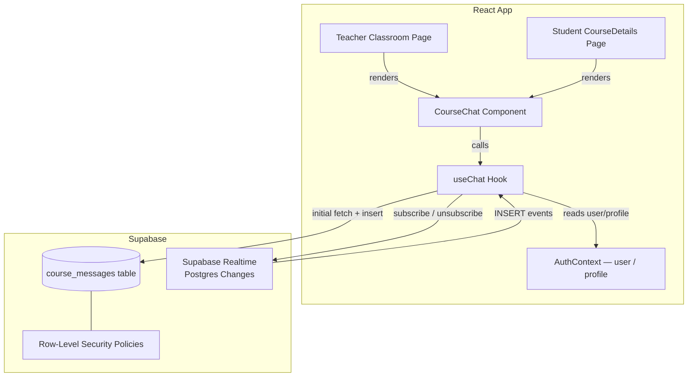
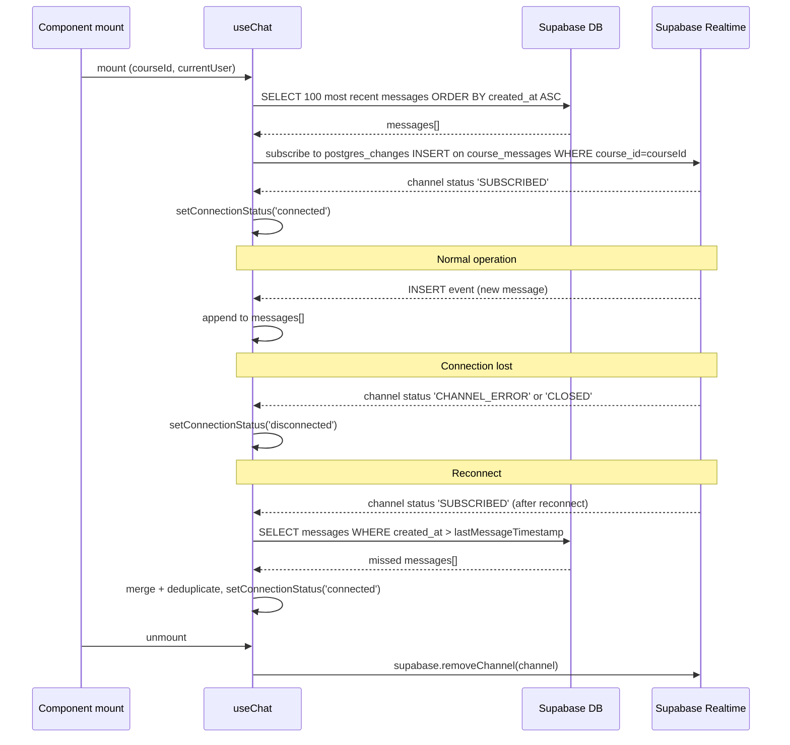

# Design Document — course-chat

## Overview

The `course-chat` feature adds a real-time, per-course chat channel to the Smart Education platform. Each course gets its own isolated chat space where the teacher and enrolled students can exchange messages without page reloads.

Two existing pages are updated:

- **Teacher Classroom** (`/teacher/classroom/:id`) — the non-functional "Chat coming soon…" placeholder is replaced with a live `CourseChat` component.
- **Student Course Details** (`/student/courses/:id`) — a third "Chat" tab is added alongside the existing "Assignments" and "Notes" tabs.

Both surfaces share a single reusable `CourseChat` component backed by a `useChat` custom hook. Real-time delivery uses Supabase Realtime (Postgres Changes over WebSocket). Message history is persisted in a new `course_messages` table with RLS policies that restrict access to course participants only.

---

## Architecture



### Key design decisions

**Single reusable component** — `CourseChat` accepts `courseId` and `currentUser` props and is self-contained. Both the teacher and student pages simply mount it; no page-level chat state is needed.

**`useChat` hook owns all side effects** — fetching history, subscribing to Realtime, sending messages, and managing connection status are all encapsulated in the hook. The component is purely presentational.

**No context for chat state** — chat messages are local to the `useChat` hook instance. Adding chat state to `TeacherContext` or `StudentContext` would couple unrelated concerns and cause unnecessary re-renders across the app.

**Optimistic UI is not used** — messages are only added to the list when the Realtime INSERT event fires (which includes the sender's own inserts). This avoids duplicate-message bugs and keeps the list consistent with the database state.

**Realtime subscription is scoped per course** — the channel name is `course-chat-{courseId}`, so navigating between courses always creates a fresh subscription.

---

## Components and Interfaces

### `CourseChat` component

**Location:** `src/components/CourseChat/CourseChat.jsx`

**Props:**

| Prop | Type | Description |
|---|---|---|
| `courseId` | `string` (UUID) | The course whose messages to load and subscribe to |
| `currentUser` | `{ id: string, name: string, role: 'Teacher' \| 'Student' }` | The authenticated user sending/receiving messages |
| `height` | `number \| string` | Optional. CSS height of the chat panel. Defaults to `560`. |

**Rendered structure:**

```
<Paper>
  ├── <ChatHeader>          — title + connection status indicator
  ├── <MessageList>         — scrollable list of MessageBubble items
  │     └── <MessageBubble> — one per message (outgoing right / incoming left)
  └── <MessageInput>        — TextField + character count + Send button
</Paper>
```

All sub-elements are internal to `CourseChat.jsx` (not separate files) unless they grow beyond ~80 lines, in which case they are split into `src/components/CourseChat/` sub-files.

### `useChat` hook

**Location:** `src/hooks/useChat.js`

**Signature:**

```js
const {
  messages,        // Message[]
  loading,         // boolean
  error,           // string | null
  connectionStatus,// 'connected' | 'disconnected' | 'reconnecting'
  sendMessage,     // (content: string) => Promise<{ success: boolean, error?: string }>
  retryLoad,       // () => void
} = useChat(courseId, currentUser);
```

**Internal state:**

| State | Type | Purpose |
|---|---|---|
| `messages` | `Message[]` | Ordered list of loaded + realtime messages |
| `loading` | `boolean` | True while initial fetch is in progress |
| `error` | `string \| null` | Non-null when fetch or send fails |
| `connectionStatus` | `'connected' \| 'disconnected' \| 'reconnecting'` | Tracks Realtime WebSocket health |
| `lastMessageTimestamp` | `string \| null` | ISO timestamp of the last received message; used for incremental re-fetch on reconnect |

**Lifecycle:**



### Integration points

**Teacher Classroom page** (`src/pages/teacher/Classroom/index.jsx`):

The existing `<Grid item xs={12} md={8}>` chat placeholder block is replaced with:

```jsx
import CourseChat from '../../../components/CourseChat/CourseChat';

// Inside the component, derive currentUser from useAuth + course data:
const { user, profile } = useAuth();
const currentUser = { id: user.id, name: profile?.name || user.email, role: 'Teacher' };

// Replace the placeholder Paper with:
<CourseChat courseId={courseId} currentUser={currentUser} height={560} />
```

The `message` / `setMessage` local state and the disabled `TextField` + `Send` button in the placeholder are removed entirely.

**Student Course Details page** (`src/pages/student/Courses/CourseDetails.jsx`):

A third tab is added to the existing `<Tabs>` component:

```jsx
<Tab label="Chat" icon={<ChatIcon />} iconPosition="start" />
```

And a new tab panel renders `CourseChat` when `tab === 2`:

```jsx
{tab === 2 && (
  <CourseChat
    courseId={id}
    currentUser={{ id: user.id, name: profile?.name || user.email, role: 'Student' }}
  />
)}
```

---

## Data Models

### `course_messages` table

| Column | Type | Constraints | Notes |
|---|---|---|---|
| `id` | `uuid` | PK, default `gen_random_uuid()` | |
| `course_id` | `uuid` | NOT NULL, FK → `courses.id` ON DELETE CASCADE | |
| `sender_id` | `uuid` | NOT NULL, FK → `auth.users.id` | |
| `sender_name` | `text` | NOT NULL | Denormalized for display; avoids join on every read |
| `sender_role` | `text` | NOT NULL, CHECK IN ('Teacher','Student') | |
| `content` | `text` | NOT NULL, CHECK length ≤ 2000 | Client enforces ≤ 1000; DB allows up to 2000 as safety margin |
| `created_at` | `timestamptz` | NOT NULL, default `now()` | Server-generated; never set by client |

**Index:** `CREATE INDEX ON course_messages (course_id, created_at DESC)` — supports the primary query pattern (fetch N most recent messages for a course).

### TypeScript-style interface (used in JSDoc / prop-types)

```js
/**
 * @typedef {Object} Message
 * @property {string} id
 * @property {string} course_id
 * @property {string} sender_id
 * @property {string} sender_name
 * @property {'Teacher'|'Student'} sender_role
 * @property {string} content
 * @property {string} created_at  — ISO 8601 timestamptz string
 */
```

### Migration file

**Location:** `supabase/migrations/course_messages.sql`

```sql
-- course_messages: per-course real-time chat
create table if not exists public.course_messages (
  id          uuid        primary key default gen_random_uuid(),
  course_id   uuid        not null references public.courses(id) on delete cascade,
  sender_id   uuid        not null references auth.users(id),
  sender_name text        not null,
  sender_role text        not null check (sender_role in ('Teacher', 'Student')),
  content     text        not null check (char_length(content) <= 2000),
  created_at  timestamptz not null default now()
);

-- Efficient retrieval of recent messages per course
create index if not exists course_messages_course_time_idx
  on public.course_messages (course_id, created_at desc);

alter table public.course_messages enable row level security;

-- Enable Realtime for this table
alter publication supabase_realtime add table public.course_messages;

-- ── RLS Policies ──────────────────────────────────────────────────────────────

drop policy if exists "Participants can read course messages" on public.course_messages;
drop policy if exists "Participants can insert course messages" on public.course_messages;

-- READ: teacher who owns the course OR enrolled student
create policy "Participants can read course messages"
  on public.course_messages for select
  using (
    -- Teacher owns the course
    exists (
      select 1 from public.courses c
      where c.id = course_id
        and c.teacher_id = auth.uid()
    )
    or
    -- Student is actively enrolled
    exists (
      select 1 from public.enrollments e
      where e.course_id = course_messages.course_id
        and e.student_id = auth.uid()
    )
  );

-- INSERT: same participant check
create policy "Participants can insert course messages"
  on public.course_messages for insert
  with check (
    auth.uid() = sender_id
    and (
      exists (
        select 1 from public.courses c
        where c.id = course_id
          and c.teacher_id = auth.uid()
      )
      or
      exists (
        select 1 from public.enrollments e
        where e.course_id = course_messages.course_id
          and e.student_id = auth.uid()
      )
    )
  );
```

### RLS policy rationale

- **No UPDATE / DELETE policies** — messages are immutable once sent. Omitting these policies means no authenticated user can modify or delete messages via the client.
- **`sender_id = auth.uid()` in INSERT check** — prevents a user from inserting a message that impersonates another sender.
- **Unauthenticated users** — with RLS enabled and no policy covering `anon` role, unauthenticated reads return an empty result set and inserts are rejected, satisfying Requirements 3.3 and 3.4.

---

## Correctness Properties

*A property is a characteristic or behavior that should hold true across all valid executions of a system — essentially, a formal statement about what the system should do. Properties serve as the bridge between human-readable specifications and machine-verifiable correctness guarantees.*

### Property 1: Valid message insert populates all required fields

*For any* trimmed string of length between 1 and 1000 characters, calling `sendMessage` with that content SHALL produce an inserted row in `course_messages` where `course_id`, `sender_id`, `sender_name`, `sender_role`, and `created_at` are all non-null and match the expected values.

**Validates: Requirements 1.1**

---

### Property 2: Message list fetch returns at most 100 messages in ascending order

*For any* course with N messages in the database (N ≥ 0), calling `loadMessages` SHALL return `min(N, 100)` messages ordered strictly ascending by `created_at`.

**Validates: Requirements 1.3, 6.2**

---

### Property 3: Incoming message is appended to the end of the list

*For any* existing message list of length N and any new message object delivered via the Realtime callback, the resulting list SHALL have length N + 1 and the new message SHALL be the last element.

**Validates: Requirements 1.4**

---

### Property 4: Send button is disabled for all invalid inputs

*For any* string that is empty, composed entirely of whitespace characters, or whose trimmed length exceeds 1000 characters, the `isSendEnabled` derived value SHALL be `false`.

**Validates: Requirements 2.2**

---

### Property 5: Input is cleared after successful send

*For any* valid message content string, after `sendMessage` resolves successfully, the input field value SHALL be the empty string.

**Validates: Requirements 2.5**

---

### Property 6: Character count display matches input length

*For any* string of length N typed into the message input, the character count display SHALL show `"N / 1000"`.

**Validates: Requirements 2.6**

---

### Property 7: Teacher messages are rendered with a "Teacher" badge

*For any* message object where `sender_role === 'Teacher'`, the rendered `MessageBubble` SHALL contain a visible "Teacher" badge element and SHALL use a visually distinct background color compared to student messages.

**Validates: Requirements 4.3, 5.3**

---

### Property 8: Sender name is always displayed with "Unknown" fallback

*For any* message object, the rendered `MessageBubble` SHALL display the `sender_name` value if it is a non-empty string, or the literal string `"Unknown"` if `sender_name` is null, undefined, or an empty/whitespace-only string.

**Validates: Requirements 7.1**

---

### Property 9: Timestamp formatting is correct for all dates

*For any* ISO 8601 timestamp string, the `formatMessageTime` utility function SHALL return a string matching `"HH:MM AM/PM"` if the date is the current calendar day, and `"MMM DD, HH:MM AM/PM"` if the date is any prior day.

**Validates: Requirements 7.2**

---

### Property 10: Message alignment matches sender identity

*For any* message object and any current user id, the rendered `MessageBubble` SHALL apply right-alignment (outgoing) styles when `message.sender_id === currentUser.id`, and left-alignment (incoming) styles when `message.sender_id !== currentUser.id`.

**Validates: Requirements 7.3, 7.4**

---

## Error Handling

| Failure scenario | Detection | User-facing response |
|---|---|---|
| Initial message history fetch fails | `supabase.from(...).select(...)` returns `error` | Inline error alert + "Retry" button; message list is empty with no partial data shown |
| Message send (insert) fails | `supabase.from(...).insert(...)` returns `error` | Inline error snackbar; draft text is preserved in the input field |
| Realtime WebSocket disconnects | Channel status event `'CHANNEL_ERROR'` or `'CLOSED'` | Non-blocking yellow banner: "Connection lost — messages may be delayed" |
| Realtime reconnects | Channel status event `'SUBSCRIBED'` after prior disconnect | Banner dismissed; incremental fetch of missed messages; merge into list |
| Re-subscription after reconnect fails | Channel status remains non-`'SUBSCRIBED'` after retry | Inline error + manual "Retry connection" button |
| `sender_name` is null/empty | Checked in `MessageBubble` render | Display "Unknown" as fallback |

**Error state isolation** — errors from one operation (e.g., a failed send) do not clear or overwrite errors from another (e.g., a disconnection banner). Each error type has its own state variable in `useChat`.

---

## Testing Strategy

No property-based testing library is currently installed in this project (`package.json` has no `fast-check`, `hypothesis`, or similar). The project also has no test runner configured. Given the feature includes several pure utility functions and well-defined rendering rules, the testing strategy uses:

1. **Unit tests** for pure functions (`formatMessageTime`, `isSendEnabled`, message list append logic)
2. **Component tests** with React Testing Library for rendering properties (badge display, alignment, character count, error states)
3. **Integration tests** for RLS policies (run against a local Supabase instance or test project)

### Recommended setup

Install [Vitest](https://vitest.dev/) and [React Testing Library](https://testing-library.com/docs/react-testing-library/intro/):

```bash
npm install --save-dev vitest @testing-library/react @testing-library/user-event @testing-library/jest-dom jsdom
```

Add to `vite.config.js`:

```js
test: {
  environment: 'jsdom',
  setupFiles: ['./src/test/setup.js'],
}
```

### Unit tests — pure functions

**`formatMessageTime(isoString)`**
- Today's date → returns `"HH:MM AM/PM"` format
- Yesterday's date → returns `"MMM DD, HH:MM AM/PM"` format
- Boundary: midnight today vs. 23:59 yesterday

**`isSendEnabled(inputValue)`**
- Empty string → `false`
- Whitespace-only strings (spaces, tabs, newlines) → `false`
- String of length 1001 → `false`
- String of length 1 → `true`
- String of length 1000 → `true`

**Message list append (pure reducer)**
- Appending to empty list → list of length 1
- Appending to list of N → list of length N + 1, new item is last
- Duplicate id (same message arrives twice) → list length unchanged (deduplication)

### Component tests — rendering properties

**`MessageBubble`**
- Teacher message → "Teacher" badge present, distinct background
- Student message → no "Teacher" badge
- `sender_name` null → displays "Unknown"
- `sender_name` empty string → displays "Unknown"
- `sender_id === currentUser.id` → right-aligned container
- `sender_id !== currentUser.id` → left-aligned container
- Timestamp rendered for every message

**`CourseChat`**
- Input empty → Send button disabled
- Input whitespace-only → Send button disabled
- Input 1001 chars → Send button disabled, character count shows "1001 / 1000"
- Input valid → Send button enabled
- Typing updates character count display
- Enter key with valid input → `sendMessage` called
- Successful send → input cleared
- Failed send → error snackbar shown, input preserved
- Failed history load → error alert + retry button shown
- Connection lost → yellow banner shown
- Connection restored → banner dismissed

### Integration tests — RLS policies

Run against a local Supabase instance (`supabase start`):

1. **Teacher reads own course messages** → returns rows
2. **Enrolled student reads course messages** → returns rows
3. **Non-enrolled authenticated user reads** → returns empty array
4. **Unauthenticated read** → returns empty array
5. **Teacher inserts message** → succeeds
6. **Enrolled student inserts message** → succeeds
7. **Non-enrolled user inserts** → returns authorization error
8. **Unauthenticated insert** → returns authorization error
9. **Insert with `sender_id` ≠ `auth.uid()`** → rejected by RLS `with check`

### Property test tags

Each component/unit test that validates a correctness property is tagged with a comment:

```js
// Feature: course-chat, Property 4: Send button is disabled for all invalid inputs
it('disables send for whitespace-only input', () => { ... });
```
