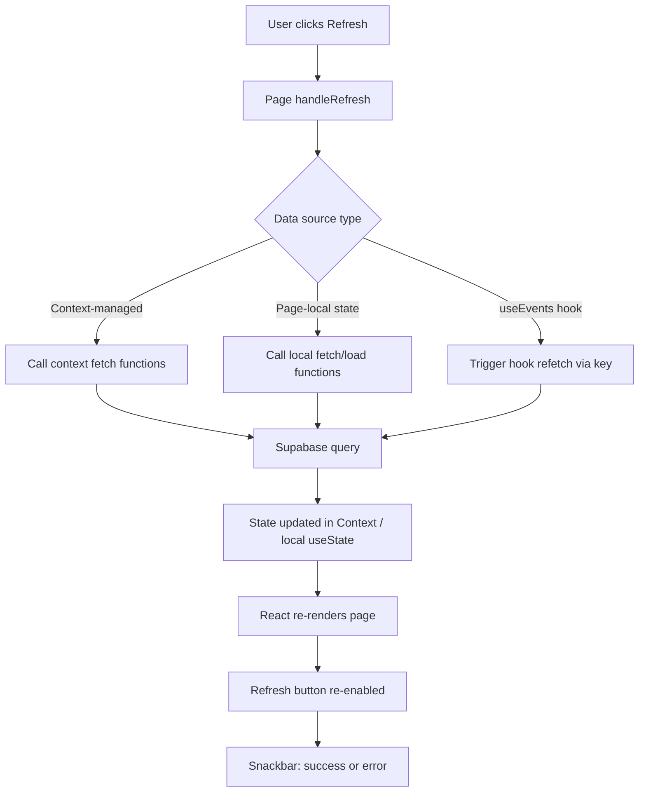
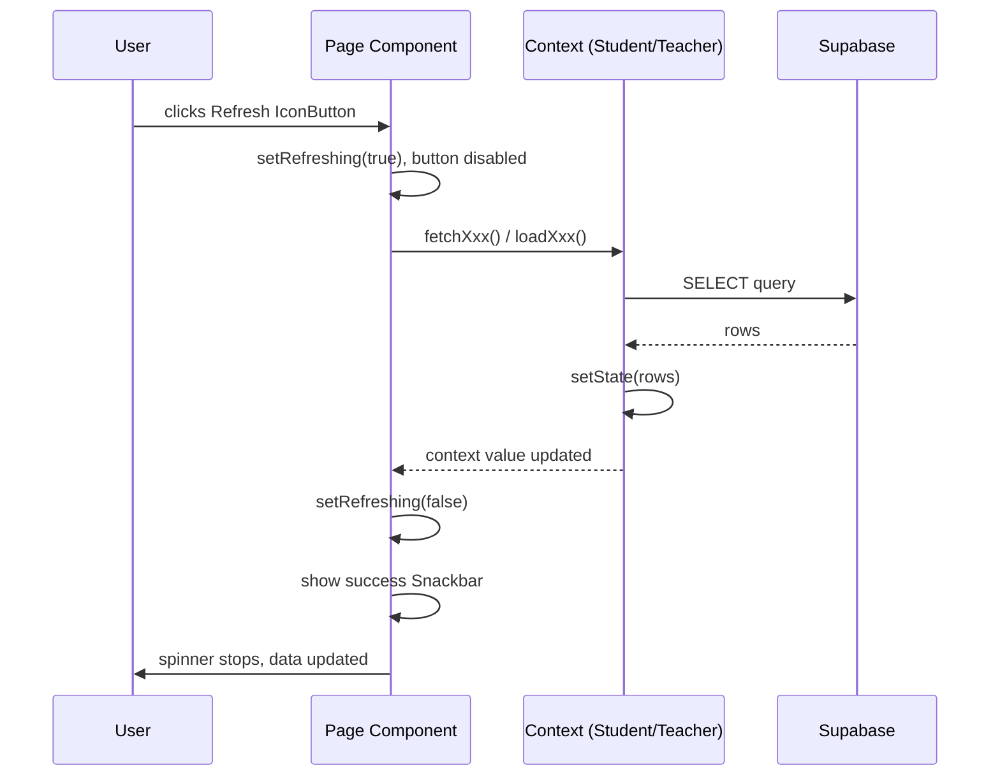
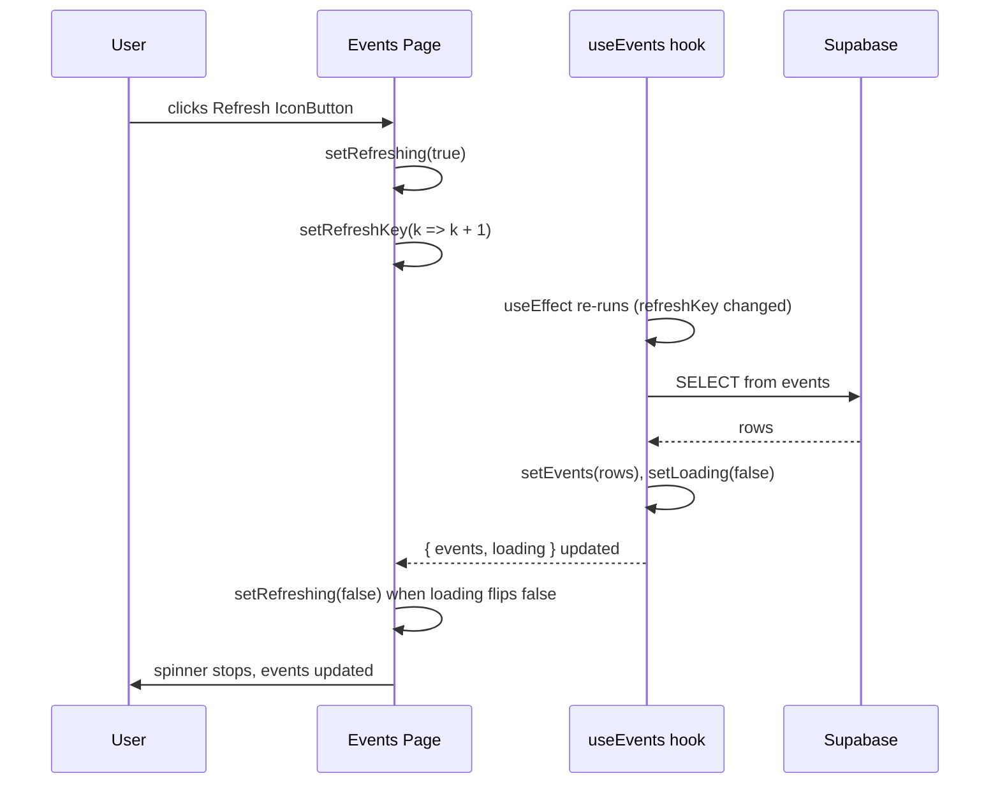

# Design Document: Dashboard Refresh

## Overview

This feature adds a consistent, manual refresh capability to every page in the student and teacher dashboards of the Smart Education web application. Users can trigger a data re-fetch from Supabase at any time without performing a full browser page reload. The refresh button provides visual feedback (spinning icon + disabled state) during the operation and shows a brief success/error notification when complete.

The feature builds on the existing partial implementation — both the Student Dashboard home and Teacher Dashboard home already have a working `handleRefresh` pattern — and extends it uniformly to all remaining pages: Courses, Assignments, Attendance, Grades, Events, and Profile for students; and Courses, Classroom, Attendance, Assignments, Grades, Notes, and Events for teachers.

---

## Architecture



### Key Architectural Decisions

1. **No new global refresh context.** Each page owns its own `refreshing` state and `handleRefresh` function. This keeps pages independent and avoids unnecessary re-renders across the whole dashboard when only one page refreshes.

2. **Refresh button placement in the page header.** Every page already has a header `Box` with a title and optional action buttons. The refresh `IconButton` is added to that header area — consistent with the existing pattern on the Dashboard home pages.

3. **`useEvents` hook refetch via `refreshKey`.** The `useEvents` hook currently has no imperative refresh API. Rather than rewriting it, pages that use it pass a `refreshKey` integer prop; incrementing it causes the hook's `useEffect` to re-run and re-fetch.

4. **Snackbar feedback.** A lightweight `Snackbar` + `Alert` (already used in `StudentLayout` and teacher pages) is added to each page to confirm success or surface errors after refresh.

---

## Sequence Diagrams

### Standard Page Refresh Flow



### Events Page Refresh Flow (hook-based)



---

## Components and Interfaces

### RefreshButton (inline pattern, not a separate component)

Each page implements the refresh button inline using MUI `IconButton` + `Tooltip`. This avoids over-abstracting a two-line pattern. The consistent shape across all pages is:

```typescript
interface RefreshButtonProps {
  refreshing: boolean;          // controls disabled state and spinner
  onRefresh: () => Promise<void>; // async handler
  tooltipTitle?: string;        // defaults to "Refresh"
}
```

Rendered as:
```tsx
<Tooltip title="Refresh">
  <span>
    <IconButton onClick={handleRefresh} disabled={refreshing} size="small">
      {refreshing
        ? <CircularProgress size={20} color="inherit" />
        : <Refresh />}
    </IconButton>
  </span>
</Tooltip>
```

> The `<span>` wrapper is required by MUI so the Tooltip works on a disabled button.

### useEvents Hook — Extended Interface

The `useEvents` hook gains an optional `refreshKey` parameter so callers can imperatively trigger a re-fetch:

```typescript
// Current signature
const useEvents = (role: 'all' | 'students' | 'teachers') => { events, loading }

// Extended signature
const useEvents = (
  role: 'all' | 'students' | 'teachers',
  refreshKey?: number           // increment to re-fetch
) => { events, loading }
```

The hook's `useEffect` dependency array changes from `[role]` to `[role, refreshKey]`.

### StudentContext — Exposed Refresh Functions

The following functions are already exported from `StudentContext` and are used by refresh handlers:

| Function | Refreshes |
|---|---|
| `fetchActiveSessions()` | Active class sessions |
| `fetchAttendanceHistory()` | Attendance records |
| `fetchGrades()` | Grade entries |
| `fetchEnrollments()` | Enrollment list |
| `fetchAllCourses()` | Course catalogue |

`fetchGrades` and `fetchAllCourses` / `fetchEnrollments` are currently internal (not in the context `value`). They need to be added to the exported value object.

### TeacherContext — Exposed Refresh Functions

Already exported:

| Function | Refreshes |
|---|---|
| `fetchCourses()` | Teacher's courses |
| `fetchTeacherLogs()` | Activity log |
| `fetchGradeEntries(courseId)` | Grade entries for a course |
| `fetchEnrolledStudents(courseId)` | Students in a course |
| `fetchAttendance(courseId, date)` | Attendance for a date |
| `fetchWeights(courseId)` | Course grade weights |

---

## Data Models

### Per-Page Refresh State

Each page that gains a refresh button holds this local state:

```typescript
const [refreshing, setRefreshing] = useState<boolean>(false);
const [snackbar, setSnackbar] = useState<{
  open: boolean;
  message: string;
  severity: 'success' | 'error' | 'info';
}>({ open: false, message: '', severity: 'success' });
```

### Refresh Handler Shape

```typescript
const handleRefresh = async (): Promise<void> => {
  setRefreshing(true);
  try {
    await Promise.all([
      fetchFunctionA(),
      fetchFunctionB(),
      // ...
    ]);
    setSnackbar({ open: true, message: 'Data refreshed', severity: 'success' });
  } catch {
    setSnackbar({ open: true, message: 'Refresh failed', severity: 'error' });
  } finally {
    setRefreshing(false);
  }
};
```

---

## Algorithmic Pseudocode

### Page Refresh Algorithm

```pascal
PROCEDURE handleRefresh()
  INPUT: none
  OUTPUT: side effects — updated UI state

  SEQUENCE
    setRefreshing(true)
    
    TRY
      PARALLEL
        fetchDataSource1()
        fetchDataSource2()
        // additional sources as needed per page
      END PARALLEL
      
      setSnackbar({ open: true, message: 'Data refreshed', severity: 'success' })
    CATCH error
      setSnackbar({ open: true, message: 'Refresh failed', severity: 'error' })
    FINALLY
      setRefreshing(false)
    END TRY
  END SEQUENCE
END PROCEDURE
```

**Preconditions:**
- User is authenticated (context is available)
- Page is mounted and not already refreshing

**Postconditions:**
- `refreshing` is `false`
- All data sources have been re-fetched or an error snackbar is shown
- Button is re-enabled

**Loop Invariants:** N/A (no loops)

### useEvents Refetch Algorithm

```pascal
PROCEDURE useEvents(role, refreshKey)
  INPUT: role ∈ { 'all', 'students', 'teachers' }, refreshKey ∈ ℕ
  OUTPUT: { events: Event[], loading: boolean }

  SEQUENCE
    ON MOUNT OR WHEN (role OR refreshKey) CHANGES DO
      setLoading(true)
      
      TRY
        today ← currentDate()
        rows ← supabase.events
                 .where(date >= today)
                 .orderBy(date, ASC)
        
        filtered ← rows.filter(e => e.target = 'all' OR e.target = role)
        setEvents(filtered)
      CATCH err
        log(err)
      FINALLY
        setLoading(false)
      END TRY
    END ON
  END SEQUENCE
END PROCEDURE
```

**Preconditions:**
- `role` is one of the valid enum values
- `refreshKey` is a non-negative integer (starts at 0)

**Postconditions:**
- `loading` is `false` after fetch completes
- `events` contains only future events matching the role filter

---

## Page-by-Page Refresh Mapping

### Student Pages

| Page | Data Sources Refreshed | Context Functions Called |
|---|---|---|
| Dashboard (existing) | Active sessions, attendance history, notifications | `fetchActiveSessions`, `fetchAttendanceHistory`, local `loadNotifications` |
| Courses | Enrollments + all courses | `fetchEnrollments`, `fetchAllCourses` (expose from context) |
| Assignments | Assignments + completions | Local `load()` callback |
| Attendance | Attendance history | `fetchAttendanceHistory` |
| Grades | Grade entries | `fetchGrades` (expose from context) |
| Events | Events + upcoming assignments | `setRefreshKey(k+1)` for hook, local assignment fetch |
| Profile | Profile data | `useAuth` profile re-fetch (or page-local fetch) |

### Teacher Pages

| Page | Data Sources Refreshed | Context Functions Called |
|---|---|---|
| Dashboard (existing) | Courses, activity logs | `fetchCourses`, `fetchTeacherLogs` |
| Courses | Courses list | `fetchCourses` |
| Classroom | Active session + attendance | `fetchActiveSession(courseId)`, `fetchSessionAttendance` |
| Attendance | Enrolled students + history | `fetchEnrolledStudents(courseId)`, local `fetchHistory` |
| Grades | Grade entries + weights | `fetchGradeEntries(courseId)`, `fetchWeights(courseId)` |
| Assignments | Assignments for teacher's courses | Local fetch |
| Events | Events | `setRefreshKey(k+1)` for hook |
| Profile | Profile data | Page-local fetch |

---

## Key Functions with Formal Specifications

### handleRefresh (generic page)

```typescript
async function handleRefresh(): Promise<void>
```

**Preconditions:**
- `refreshing === false` (button is not already disabled)
- Component is mounted

**Postconditions:**
- All awaited fetch calls have resolved or rejected
- `refreshing === false`
- `snackbar.open === true` with appropriate severity

### useEvents (extended)

```typescript
function useEvents(
  role: 'all' | 'students' | 'teachers',
  refreshKey: number = 0
): { events: Event[]; loading: boolean }
```

**Preconditions:**
- `role` is a valid string literal
- `refreshKey >= 0`

**Postconditions:**
- When `refreshKey` increments, a new Supabase query is issued
- `loading` transitions `false → true → false` around each fetch
- `events` contains only records where `date >= today` and `target ∈ {role, 'all'}`

---

## Example Usage

### Student Assignments Page — Adding Refresh

```tsx
// Before: no refresh button
const StudentAssignments = () => {
  const load = useCallback(async () => { /* ... */ }, [enrollments, user?.id]);
  useEffect(() => { load(); }, [load]);
  // ...
};

// After: refresh button added to header
const StudentAssignments = () => {
  const [refreshing, setRefreshing] = useState(false);
  const [snackbar, setSnackbar] = useState({ open: false, message: '', severity: 'success' });

  const load = useCallback(async () => { /* existing logic */ }, [enrollments, user?.id]);
  useEffect(() => { load(); }, [load]);

  const handleRefresh = async () => {
    setRefreshing(true);
    try {
      await load();
      setSnackbar({ open: true, message: 'Assignments refreshed', severity: 'success' });
    } catch {
      setSnackbar({ open: true, message: 'Refresh failed', severity: 'error' });
    } finally {
      setRefreshing(false);
    }
  };

  return (
    <Box>
      <Box display="flex" justifyContent="space-between" alignItems="center" mb={4}>
        <Box>
          <Typography variant="h4" fontWeight="bold">Assignments</Typography>
          <Typography variant="subtitle1" color="text.secondary">
            Track your work across all courses
          </Typography>
        </Box>
        <Tooltip title="Refresh">
          <span>
            <IconButton onClick={handleRefresh} disabled={refreshing} size="small">
              {refreshing ? <CircularProgress size={20} color="inherit" /> : <Refresh />}
            </IconButton>
          </span>
        </Tooltip>
      </Box>
      {/* rest of page... */}
      <Snackbar open={snackbar.open} autoHideDuration={3000}
        onClose={() => setSnackbar(s => ({ ...s, open: false }))}
        anchorOrigin={{ vertical: 'bottom', horizontal: 'center' }}>
        <Alert severity={snackbar.severity}>{snackbar.message}</Alert>
      </Snackbar>
    </Box>
  );
};
```

### Student Events Page — Refresh with useEvents Hook

```tsx
const StudentEvents = () => {
  const [refreshKey, setRefreshKey] = useState(0);
  const [refreshing, setRefreshing] = useState(false);
  const { events, loading } = useEvents('students', refreshKey);

  const handleRefresh = async () => {
    setRefreshing(true);
    setRefreshKey(k => k + 1);
    // refreshing will be set false once loading flips back to false
  };

  // Watch loading to know when hook fetch is done
  useEffect(() => {
    if (!loading && refreshing) {
      setRefreshing(false);
    }
  }, [loading, refreshing]);

  // ...
};
```

### useEvents Hook — Extended

```typescript
const useEvents = (role: string, refreshKey: number = 0) => {
  const [events, setEvents] = useState([]);
  const [loading, setLoading] = useState(true);

  useEffect(() => {
    const fetch = async () => {
      setLoading(true);
      try {
        const today = new Date().toISOString().split('T')[0];
        const { data, error } = await supabase
          .from('events')
          .select('*')
          .gte('date', today)
          .order('date', { ascending: true });
        if (error) throw error;
        setEvents((data || []).filter(e => e.target === 'all' || e.target === role));
      } catch (err) {
        console.error('Failed to fetch events:', err);
      } finally {
        setLoading(false);
      }
    };
    fetch();
  }, [role, refreshKey]); // refreshKey added to deps

  return { events, loading };
};
```

---

## Correctness Properties

- For all pages P: after `handleRefresh()` resolves, `refreshing === false`
- For all pages P: the refresh button is disabled while `refreshing === true`
- For all pages P: a Snackbar notification is shown after every refresh attempt (success or error)
- For all pages P: calling `handleRefresh()` while `refreshing === true` is impossible (button is disabled)
- For `useEvents`: incrementing `refreshKey` always triggers a new Supabase query
- For `useEvents`: `loading` is `true` for the entire duration of the fetch and `false` otherwise
- Context fetch functions are idempotent: calling them multiple times produces the same final state as calling once (last write wins)

---

## Error Handling

### Scenario 1: Network / Supabase Error During Refresh

**Condition**: One or more Supabase queries fail (network timeout, RLS policy error, etc.)

**Response**: The `catch` block in `handleRefresh` sets the snackbar to `severity: 'error'` with message "Refresh failed". The page retains its previous data.

**Recovery**: User can retry by clicking the refresh button again. The button is re-enabled immediately after the error.

### Scenario 2: Partial Failure (Promise.all)

**Condition**: One of multiple parallel fetches fails while others succeed.

**Response**: `Promise.all` rejects on the first failure. The error snackbar is shown. Some data may be stale.

**Recovery**: For critical pages (Grades, Attendance), consider `Promise.allSettled` instead of `Promise.all` so partial successes still update state. This is a per-page implementation decision.

### Scenario 3: Rapid Repeated Clicks

**Condition**: User clicks refresh multiple times quickly.

**Response**: The button is disabled (`disabled={refreshing}`) as soon as the first click fires, preventing duplicate requests.

**Recovery**: N/A — prevented by design.

### Scenario 4: Component Unmounts During Refresh

**Condition**: User navigates away while a refresh is in progress.

**Response**: The async fetch completes but `setState` calls on an unmounted component produce React warnings.

**Recovery**: Pages that use `useCallback`-based loaders (like Assignments) are already safe because the callback reference becomes stale. For other pages, an `isMounted` ref guard can be added if warnings appear in practice.

---

## Testing Strategy

### Unit Testing Approach

Test each page's `handleRefresh` function in isolation by mocking context functions and verifying:
- `refreshing` transitions `false → true → false`
- Context fetch functions are called
- Snackbar state is set correctly on success and error

### Property-Based Testing Approach

**Property Test Library**: `fast-check`

Key properties to test:
- `handleRefresh` always sets `refreshing` to `false` after completion, regardless of whether fetches succeed or fail
- The refresh button is never enabled while `refreshing === true`
- `useEvents` with any `refreshKey >= 0` always returns `loading: false` after the fetch settles

### Integration Testing Approach

- Mount the full page with a mocked Supabase client
- Click the refresh button
- Assert the spinner appears, fetch is called, spinner disappears, and snackbar shows

---

## Performance Considerations

- Refresh calls are user-initiated, so there is no risk of polling overhead.
- `Promise.all` parallelises multiple fetches, keeping total refresh time equal to the slowest single query rather than the sum.
- Pages that already have real-time Supabase subscriptions (e.g., Student Dashboard active sessions, Teacher Classroom) benefit less from manual refresh but it still serves as a fallback for subscription gaps.
- No debounce is needed because the button is disabled during the refresh operation.

---

## Security Considerations

- All Supabase queries in the refresh handlers use the same RLS-protected queries as the initial load. No additional permissions are required.
- The refresh button is only rendered for authenticated users (all pages are behind `ProtectedRoute`).
- No sensitive data is exposed through the refresh mechanism beyond what is already visible on the page.

---

## Dependencies

- **MUI**: `IconButton`, `Tooltip`, `CircularProgress`, `Snackbar`, `Alert` — all already used in the project
- **`@mui/icons-material`**: `Refresh` icon — already imported on Dashboard pages
- **Supabase client**: `supabaseClient.js` — already used throughout
- **`StudentContext`**: needs `fetchGrades`, `fetchAllCourses`, `fetchEnrollments` added to exported `value`
- **`useEvents` hook**: needs `refreshKey` parameter added to `useEffect` dependency array
